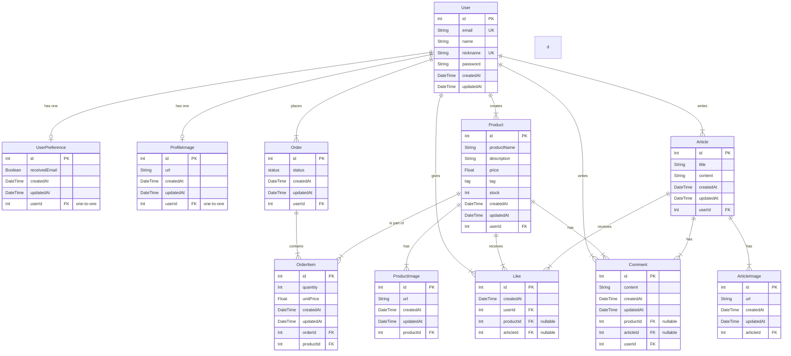

```mermaid
erDiagram
User {
Int id PK
String email UK
String name
String nickname UK
String password
DateTime createdAt
DateTime updatedAt
}

    UserPreference {
        Int id PK
        Boolean receivedEmail
        DateTime createdAt
        DateTime updatedAt
        Int userId FK "one-to-one"
    }

    ProfileImage {
        Int id PK
        String url
        DateTime createdAt
        DateTime updatedAt
        Int userId FK "one-to-one"
    }

    Order {
        Int id PK
        status status
        DateTime createdAt
        DateTime updatedAt
        Int userId FK
    }

    OrderItem {
        Int id PK
        Int quantity
        Float unitPrice
        DateTime createdAt
        DateTime updatedAt
        Int orderId FK
        Int productId FK
    }

    Product {
        Int id PK
        String productName
        String description
        Float price
        tag tag
        Int stock
        DateTime createdAt
        DateTime updatedAt
        Int userId FK
    }

    ProductImage {
        Int id PK
        String url
        DateTime createdAt
        DateTime updatedAt
        Int productId FK
    }

    Article {
        Int id PK
        String title
        String content
        DateTime createdAt
        DateTime updatedAt
        Int userId FK
    }

    ArticleImage {
        Int id PK
        String url
        DateTime createdAt
        DateTime updatedAt
        Int articleId FK
    }

    Like {
        Int id PK
        DateTime createdAt
        Int userId FK
        Int productId FK "nullable"
        Int articleId FK "nullable"
    }

d
Comment {
Int id PK
String content
DateTime createdAt
DateTime updatedAt
Int productId FK "nullable"
Int articleId FK "nullable"
Int userId FK
}

    User ||--o| UserPreference : "has one"
    User ||--o| ProfileImage : "has one"
    User ||--|{ Order : "places"
    User ||--|{ Product : "creates"
    User ||--|{ Article : "writes"
    User ||--|{ Like : "gives"
    User ||--|{ Comment : "writes"

    Order ||--|{ OrderItem : "contains"

    Product ||--|{ OrderItem : "is part of"
    Product ||--|{ ProductImage : "has"
    Product ||--|{ Like : "receives"
    Product ||--|{ Comment : "has"

    Article ||--|{ ArticleImage : "has"
    Article ||--|{ Like : "receives"
    Article ||--|{ Comment : "has"
```
