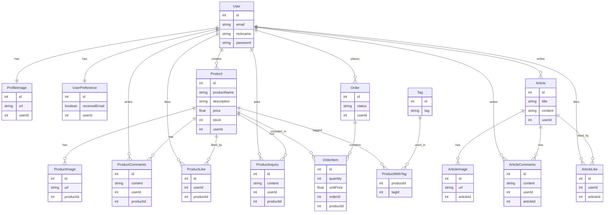

```mermaid
erDiagram
User {
int id
string email
string nickname
string password
}

ProfileImage {
int id
string url
int userId
}

UserPreference {
int id
boolean receivedEmail
int userId
}

Product {
int id
string productName
string description
float price
int stock
int userId
}

ProductImage {
int id
string url
int productId
}

ProductComments {
int id
string content
int userId
int productId
}

ProductLike {
int id
int userId
int productId
}

ProductInquiry {
int id
string content
int userId
int productId
}

Tag {
int id
string tag
}

ProductWithTag {
int productId
int tagId
}

Article {
int id
string title
string content
int userId
}

ArticleImage {
int id
string url
int articleId
}

ArticleComments {
int id
string content
int userId
int articleId
}

ArticleLike {
int id
int userId
int articleId
}

Order {
int id
string status
int userId
}

OrderItem {
int id
int quantity
float unitPrice
int orderId
int productId
}

User ||--|| ProfileImage : has
User ||--|| UserPreference : has
User ||--o{ Product : creates
User ||--o{ Article : writes
User ||--o{ Order : places
User ||--o{ ProductComments : writes
User ||--o{ ArticleComments : writes
User ||--o{ ProductLike : likes
User ||--o{ ArticleLike : likes
User ||--o{ ProductInquiry : asks

Product ||--o{ ProductImage : has
Product ||--o{ ProductComments : has
Product ||--o{ ProductLike : liked_by
Product ||--o{ ProductInquiry : has
Product ||--o{ OrderItem : included_in
Product ||--o{ ProductWithTag : tagged

Tag ||--o{ ProductWithTag : used_in

Article ||--o{ ArticleImage : has
Article ||--o{ ArticleComments : has
Article ||--o{ ArticleLike : liked_by

Order ||--o{ OrderItem : contains
```
